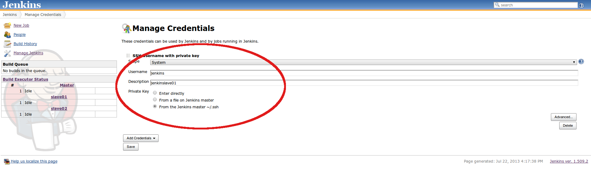
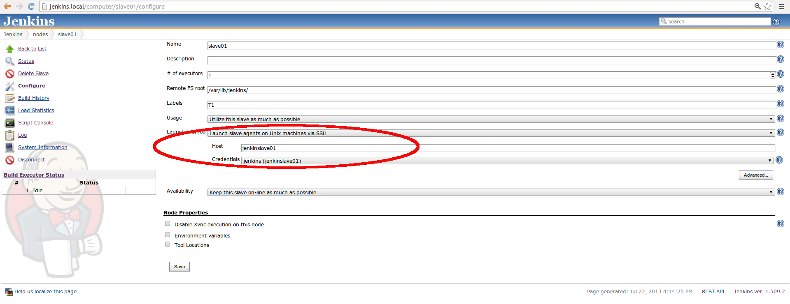
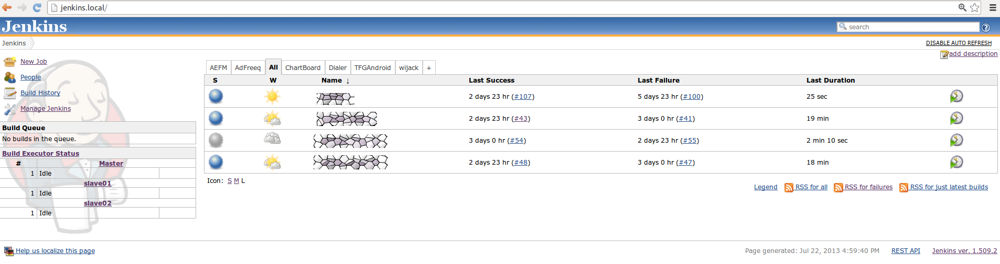
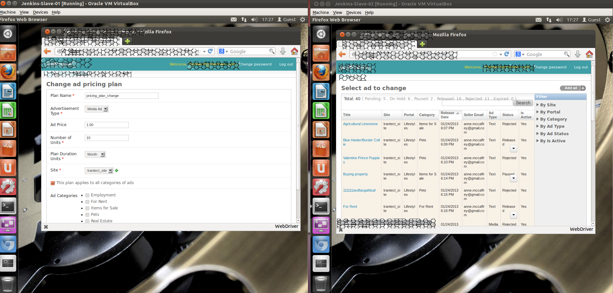

##Overview

At present, Trantect is working on a Django-based project with a lot of test cases based on Selenose. Months ago, we made a decision of running test cases with Jekins Cluster since we discovered that running test cases manually cost us too much time. And with Jenkins running on a single machine, it functioned slowlier and slowlier along with the increment of the number of test cases, due to its function mechanism, such as serialization, synchronization and blocking. In order to perform our test cases automatically and efficiently, we built up Jenkins cluster including one master and two slaves to run our projects and test cases concurrently, isolatedly and distributedly. 

### What is Jenkins and Jenkins Cluster?

Jenkins is an open source continuous integration tool written in Java. The project was forked from Hudson, it provides continuous integration services for software development and helps developers to build, test and deploy their projects. It is a server-based system running in a servlet container such as Apache Tomcat. It supports SCM tools including CVS, Subversion, Git, Mercurial, Perforce, Clearcase and RTC, and can execute Apache Ant and Apache Maven based projects as well as arbitrary shell scripts and Windows batch commands. Jenkins is released under the MIT License and is a free software. (refer to [http://en.wikipedia.org/wiki/Jenkins_(software)](http://en.wikipedia.org/wiki/Jenkins_(software))

Jenkins Cluster is a set of instances which can be individual machines or virtual machines. Among those instances, one should be selected as master and the others should be slaves. Jenkins runs on the master, and manages projects and launches slave agents to build projects concurrently, isolatedly via SSH, Java Web Start or executing customized commands.

### Why is Jenkins needed?

Jenkins provides continuous integration services which help developers to build, test and deploy their projects automatically and rapidly. Within Jenkins, developers just need to focus on development and let Jekins give services to the rest.

### Why is Jenkins Cluster needed?

Overmany and heavyweight projects running on Jenkins causes the machine overloaded, and Jenkins Cluster can overwhelm that. It provides functionality of distributing our project(s) onto different instances to run concurrently and isolatedly, therefore it speeds up the performence. 

### Why Jenkins Cluter has a higher performance than the one without hardware upgrade?

Jenkins on single machine runs projects serially, synchronously and with blocking. It means once a single project is blocked, the others can not be started.

Thanks to the distribution feature of Jekins, we can divide our machine into several virtual ones where instances of Jenkins Cluster work on, with the achievement of more sufficient usage of resources and higher performance of projects.

###Jenkins introduction 

Please refer to [https://wiki.jenkins-ci.org/display/JENKINS/Use+Jenkins](https://wiki.jenkins-ci.org/display/JENKINS/Use+Jenkins)

## Hardware and Software Required

- Host machine (physics machine)

	- Hardware

            Memory 8.0 GiB
            Processor Intel® Celeron(R) CPU G1610 @ 2.60GHz x 2
            Disk 500GB
            OS type 64-bit

	- Software

            Ubuntu 11.10 or higher
            Oracle VM VirtualBox 4.1.2

- Virtual machine as master

	- Hardware

            Memory 2.0 GiB
            Processor Intel® Celeron(R) CPU G1610 @ 2.60GHz
            Disk 20GB
            OS type 64-bit

	- Software

            Ubuntu 11.10 or higher
            JDK 1.6
            Apache 2.2.20
            Jenkins ver. 1.509.2
            SSH Credentials Plugin (Jenkins Plugin) 0.4 

- Virtual machine as slave

	- Hardware

            Memory 1.0 GiB
            Processor Intel® Celeron(R) CPU G1610 @ 2.60GHz
            Disk 20GB
            OS type 64-bit

	- Software

            Ubuntu 11.10 or higher
            SSHD 

##Jenkins Cluster Setup

- Create master

	- NOTICE: refer to this article [http://www.perkin.org.uk/posts/create-virtualbox-vm-from-the-command-line.html](http://www.perkin.org.uk/posts/create-virtualbox-vm-from-the-command-line.html)
    
	- Use Ubuntu 11.10 as example

        `$ VM=Jenkins`

	- Create a 20GB dynamic disk

        `$ VBoxManage createhd --filename $VM.vdi --size 20480`
    
	- List the OS types VirtualBox recognises

        `$ VBoxManage list ostypes`

	- Copy the most appropriate one

        `$ VBoxManage createvm --name $VM --ostype "Ubuntu_64" --register`

	- Add a SATA controller with the dynamic disk attached

        `$ VBoxManage storagectl $VM --name "SATA Controller" --add sata --controller IntelAHCI`

        `$ VBoxManage storageattach $VM --storagectl "SATA Controller" --port 0 --device 0 --type hdd --medium $VM.vdi`

	- Add an IDE controller with a DVD driver attached, and the install ISO inserted into the driver

        `$ VBoxManage storagectl $VM --name "IDE Controller" --add ide`

        `$ VBoxManage storageattach $VM --storagectl "IDE Controller" --port 0 --device 0 --type dvddrive --medium  /path/to/ubuntu-11.10-desktop-amd64.iso`

	- Misc system settings
    
        `$ VBoxManage modifyvm $VM --ioapic on`

        `$ VBoxManage modifyvm $VM --boot1 dvd --boot2 disk --boot3 none --boot4 none`

        `$ VBoxManage modifyvm $VM --memory 2048 --vram 128`
        
        `$ VBoxManage modifyvm $VM --nic1 bridged --bridgeadapter1 e1000g0`

	- Boot up

        `$ VBoxManage --startvm $VM --type headless`

	- After you configured OS, shutdown and eject the DVD

        `$ VBoxManage storageattach $VM --storagectl "IDE Controller" --port 0 --device 0 --type dvddrive --medium none`

	- Set up hostname

        `$ sudo vim /etc/hostname` and change it to jenkins
    
- Create slave VMS referring to the previous chapter Create Master

- Clone slave

	- Clone VMS

		-  Clone VDI virtualBox disk

			- Clone virtual disk
                
                `$ VboxManage clonehd src.vdi dst.vdi`
                
			- Change uuid of VDI
                
                `$ VBoxManage internalcommands sethduuid dst.vdi`
                
		-  Create a new virtual machine based on new dst.vdi
        
	- Configure network

		- Change hostname
            
            `$ sudo vim /etc/hostname` and change it to jenkinslave01
            
		- Bridged adapter

		- Edit configuration file for network
        
            `sudo vim /etc/network/interfaces`
        
		- Remove all the other lines just keep the lines below

			auto lo
			iface lo inet loopback

- Create Jenkins Cluster on virtual machines

	- Install Jenkins on master
        
        `$ ssh jenkins@jenkins.local`
        
        `$ sudo apt-get install jenkins`
    
	- Restart master
        
	- Access Jenkins [http://jenkins.local/](http://jenkins.local/)
    
	- Update Jenkins up to version 1.5 in panel Jenkins > Manage Jenkins
        
        If Automatical upgrade fails, just donwload and replace jenkins.war
        
	- Install SSH Credentials Plugin version 0.4 in panel Jenkins > Manage Jenkins > Manage Plugins

	- Add SSH authorization from master to slaves
        
	refer to [http://rcsg-gsir.imsb-dsgi.nrc-cnrc.gc.ca/documents/internet/node31.html](http://rcsg-gsir.imsb-dsgi.nrc-cnrc.gc.ca/documents/internet/node31.html)
        
	- Add credentials in Jenkins > Manage Jenkins > Manage Credentials

	
        
	- Add slave node in jenkins
    
		- access panel Jenkins > Manage Jenkins > Manage Nodes
    
		- click the New Node link on the left column

		- select Dumb Slave and input the slave node name for example 'slave01'

		- add slave node 'slave01' like 

        

		- add slave node 'slave02' in the same way

## Projects to be tested

- Django

	- This is a web project based on Django framework.
	- Dependency

            Selenose
            Python 2.7.2
            Django 1.5
            PostgreSQL 9.1.9
            MongoDB 2.0.4
            phpPgAdmin
            Apache 2.2.20

- Android
- SCM

##Real case study

- Create projects on Jenkins Cluster

	- Project adfreeq will be triggered when code is updated on Github. It runs on master to push the latest code, data and config onto slaves and then triggers adfreeq_master, adfreeq_slave_01 and adfreeq_slave_02 as downstream projects.

	- Project adfreeq_master runs some test cases on master after project adfreeq is done.

	- Project adfreeq_slave_01 runs some other test cases on slave01 after project adfreeq is done.

	- Project adfreeq_slave_02 runs the left test cases on slave02 after project adfreeq is done.
        
    

- Screenshots
    
    

- Test environment
    
        Selenose
        Python 2.7.2
        Django 1.5
        PostgreSQL 9.1.9
        MongoDB 2.0.4
        phpPgAdmin
        Apache 2.2.20

- Performence

	- Run test cases distributedly

		- Project adfreeq takes 30 sec to checkout latest code and push the latest code, data, config onto all the slaves.

		- Project adfreeq_master takes 19 mins to run 12 test cases, 12 postgres flush, 63 asserts, 1 syncdb within 1244 lines.

		- Project adfreeq_slave_01 takes 23 mins to run 19 test cases, 19 postgres flush, 76 asserts, 1 syncdb within 739 lines.

		- Project adfreeq_slave02 takes 18 mins to run 11 test cases, 11 mongo flush, 84 asserts, 1 syncdb within 1096 lines.

	- Run all test cases on one single machine

		- It takes about more than one hour in tatal.
