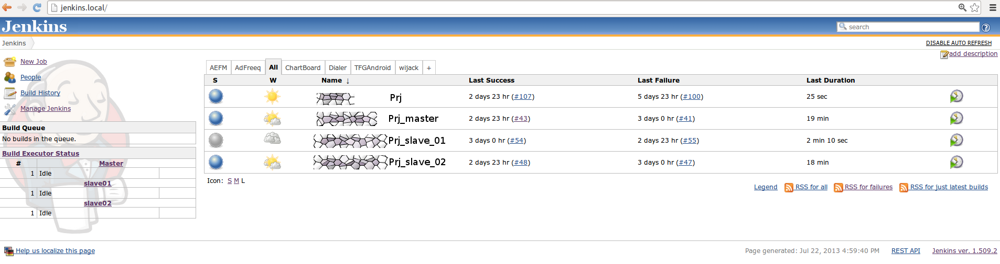

#This is just a outline for this blog. To be continued...

##Overview

Now Trantect is working on a Django-based project with a lot of test cases based on Selenose. Weeks ago, we found that running these test cases manually cost us much time.To reduce this time cost and run our test cases automatically, we built a Jenkins to manage our projects and test cases.Firstly we ran all the projects and test cases on one single machine, but with the increment of test cases, the Jenkins became slower and slower due to its serialized, synchronous and blocking work.Then, to improve the performance of Jenkins, we created a Jenkins cluster including one master and two slaves to run our projects and test cases concurrently. separately and distributedly.And the cluster performs well.

### What is Jenkins and Jenkins Cluster?

Jenkins is an open source continuous integration tool written in Java. The project was forked from Hudson, it provides continuous integration services for software development and helps developers to build, test and deploy their projects.It is a server-based system running in a servlet container such as Apache Tomcat. It supports SCM tools including CVS, Subversion, Git, Mercurial, Perforce, Clearcase and RTC, and can execute Apache Ant and Apache Maven based projects as well as arbitrary shell scripts and Windows batch commands. Jenkins is released under the MIT License and is a free software. (refer to http://en.wikipedia.org/wiki/Jenkins_(software))

Jenkins Cluster is a cluster based on Jenkins, it consists of some instances which are individual machines or virtual machines, among these instances one should be selected as master and others should be slaves. Jenkins runs on the master, it manages projects and launches slave agents to build projects concurrently, separately via SSH, Java Web Start or exceuting customized commands.

### Why is Jenkins needed?

Jenkins provides continuous integration services which help developers to build, test and deploy their projects automatically and rapidly. Within Jenkins, developers just need to focus on development and Jenkins will help to do the other things.

### Why is Jenkins Cluster needed?

Overmany or Heavyweight projects on Jenkins will make the machine overloaded, then Jenkins Cluster can deal with that, it allows to distribute our projects onto different instances to run concurrently and separately with a higher performence. If one project is too heavy, we can also divide it into several light subprojects.

### Why Jenkins Cluter has a higher performance than Jenkins without hardware upgrade?

Jenkins on single machine runs projects serially, synchronously and blocking. It means that one project is blocked, others can not be started still.
While Jenkins Cluster runs projects dly, so that if we divide our machine into several virtual machines and build Jenkins Cluster based on these instances,
we can have a more sufficient use of resources and a higher performance of projects.

###Jenkins introduction 

Please refer to https://wiki.jenkins-ci.org/display/JENKINS/Use+Jenkins

## Hardware and Software Required

* **host** machine (physics machine)
    * hardware
    
            Memory 8.0 GiB
            Processor Intel® Celeron(R) CPU G1610 @ 2.60GHz x 2
            Disk 500GB
            OS type 64-bit
            
    * software
            
            Ubuntu 11.10 or higher
            Oracle VM VirtualBox 4.1.2

* **virtual** machine as **master**
    * hardware
        
            Memory 2.0 GiB
            Processor Intel® Celeron(R) CPU G1610 @ 2.60GHz
            Disk 20GB
            OS type 64-bit
        
    * software
        
            Ubuntu 11.10 or higher
            JDK 1.6
            Apache 2.2.20
            Jenkins ver. 1.509.2
            SSH Credentials Plugin (Jenkins Plugin) 0.4 

* **virtual** machine as **slave**
    * hardware
        
            Memory 1.0 GiB
            Processor Intel® Celeron(R) CPU G1610 @ 2.60GHz
            Disk 20GB
            OS type 64-bit
        
    * software
        
            Ubuntu 11.10 or higher
            SSHD
        

##Jenkins Cluster Setup 
* Create Master 
    * **NOTICE:** refer to this article http://www.perkin.org.uk/posts/create-virtualbox-vm-from-the-command-line.html
    
    * Use Ubuntu 11.10 as example
    
        `$ VM=Jenkins`
        
    * Create a 20GB dynamic disk
    
        `$ VBoxManage createhd --filename $VM.vdi --size 20480`
    
    * List the OS types VirtualBox recognises
    
        `$ VBoxManage list ostypes`
    
    * Copy the most appropriate one
    
        `$ VBoxManage createvm --name $VM --ostype "Ubuntu_64" --register`
        
    * Add a SATA controller with the dynamic disk attached
    
        `$ VBoxManage storagectl $VM --name "SATA Controller" --add sata --controller IntelAHCI`
        
        `$ VBoxManage storageattach $VM --storagectl "SATA Controller" --port 0 --device 0 --type hdd --medium $VM.vdi`
        
    * Add an IDE controller with a DVD driver attached, and the install ISO inserted into the driver
    
        `$ VBoxManage storagectl $VM --name "IDE Controller" --add ide`
        
        `$ VBoxManage storageattach $VM --storagectl "IDE Controller" --port 0 --device 0 --type dvddrive --medium  /path/to/ubuntu-11.10-desktop-amd64.iso`
        
    * Misc system settings
    
        `$ VBoxManage modifyvm $VM --ioapic on`
        
        `$ VBoxManage modifyvm $VM --boot1 dvd --boot2 disk --boot3 none --boot4 none`
        
        `$ VBoxManage modifyvm $VM --memory 2048 --vram 128`
        
        `$ VBoxManage modifyvm $VM --nic1 bridged --bridgeadapter1 e1000g0`
    
    * Boot up
    
        `$ VBoxManage --startvm $VM --type headless`
    
    * After you configured OS, shutdown and eject the DVD
    
        `$ VBoxManage storageattach $VM --storagectl "IDE Controller" --port 0 --device 0 --type dvddrive --medium none`
        
    * Set up hostname
    
        `$ sudo vim /etc/hostname` and change it to **jenkins**
    
* Create Slave
    
    Create slave VMS referring to the previous chapter **Create Master**

* Clone Slave
    * Clone VMS
        *  Clone VDI VirtualBox Disk
            * Clone Virtual Disk
                
                `$ VboxManage clonehd src.vdi dst.vdi`
                
            * Change uuid of VDI
                
                `$ VBoxManage internalcommands sethduuid dst.vdi`
                
        *  Create a new virtual machine based on new dst.vdi
        
    * Configure network
        * Change hostname
            
            `$ sudo vim /etc/hostname` and change it to **jenkinslave01**
            
        *  Bridged adapter
        *  Edit configuration file for network
        
            `sudo vim /etc/network/interfaces`
        
            remove all the other lines just keep the lines below
            ``` javascript
                auto lo
                iface lo inet loopback
            ```
        
* Create Jenkins Cluster on virtual machines
        
    * Install Jenkins on master
        
        `$ ssh jenkins@jenkins.local`
        
        `$ sudo apt-get install jenkins`
    
    * Restart master
        
    * Access Jenkins http://jenkins.local/
    
    * Update Jenkins up to version 1.5 in panel Jenkins > Manage Jenkins
        
        If Automatical upgrade fails, just donwload and replace **jenkins.war**
        
    * Install SSH Credentials Plugin version 0.4 in panel Jenkins > Manage Jenkins > Manage Plugins
    * Add SSH authorization from master to slaves
        
        refer to http://rcsg-gsir.imsb-dsgi.nrc-cnrc.gc.ca/documents/internet/node31.html
        
    * Add credentials in Jenkins > Manage Jenkins > Manage Credentials
        
        
        
    * Add slave node in jenkins
        * access panel Jenkins > Manage Jenkins > Manage Nodes
        * click the New Node link on the left column
        * select Dumb Slave and input the slave node name for example 'slave01'
        * add slave node 'slave01' like 
        
        
        
        * add slave node 'slave02' in the same way

## Projects to be tested
* Django
    * This is a web project based on Django framework.
    * dependency
            
            Selenose
            Python 2.7.2
            Django 1.5
            PostgreSQL 9.1.9
            MongoDB 2.0.4
            phpPgAdmin
            Apache 2.2.20

* Android
* SCM

##Real case study
* Create projects on Jenkins Cluster
    * Create projects on master or slaves
        * Project adfreeq will be triggered when code is updated on Github. It runs on master to push the latest code, data and config onto slaves and then triggers adfreeq_master, adfreeq_slave_01 and adfreeq_slave_02 as downstream projects.
        * Project adfreeq_master runs some test cases on master after project adfreeq is done.
        * Project adfreeq_slave_01 runs some other test cases on slave01 after project adfreeq is done.
        * Project adfreeq_slave_02 runs the left test cases on slave02 after project adfreeq is done.
        
    

* screenshots visiable 
* test environment
    
        Selenose
        Python 2.7.2
        Django 1.5
        PostgreSQL 9.1.9
        MongoDB 2.0.4
        phpPgAdmin
        Apache 2.2.20

* performence
        
    * adfreeq takes 30 sec to checkout latest code and push the latest code, data, config onto all the slaves.
    * adfreeq_master takes 19 mins to run 12 test cases, 12 postgres flush, 63 asserts, 1 syncdb within 1244 lines.
    * adfreeq_slave_01 takes 23 mins to run 19 test cases, 19 postgres flush, 76 asserts, 1 syncdb within 739 lines.
    * adfreeq_slave02 takes 18 mins to run 11 test cases, 11 mongo flush, 84 asserts, 1 syncdb within 1096 lines.

##About Trantect

```javascript
  var Trantect = {
    Company : "Trantect"
    Site : "http://www.trantect.com"
  }
```
